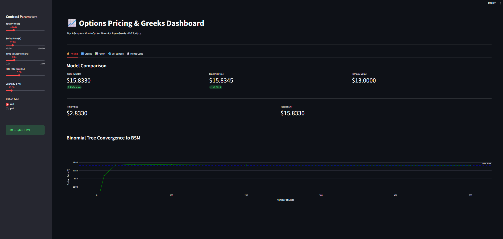
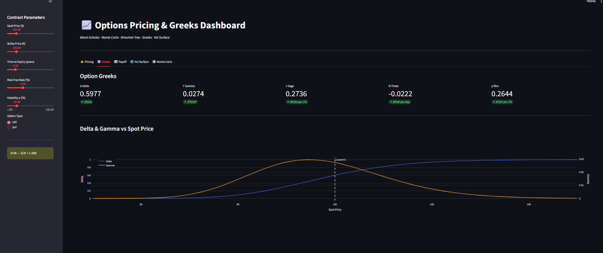
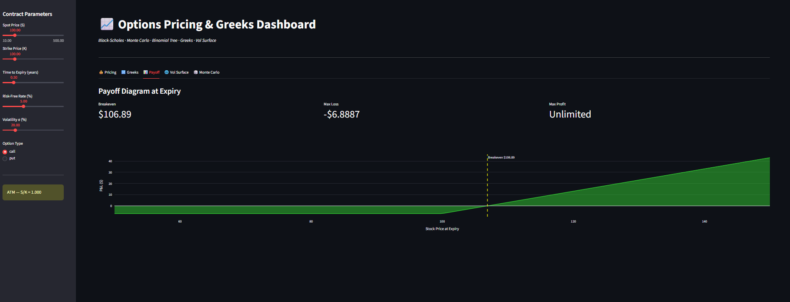
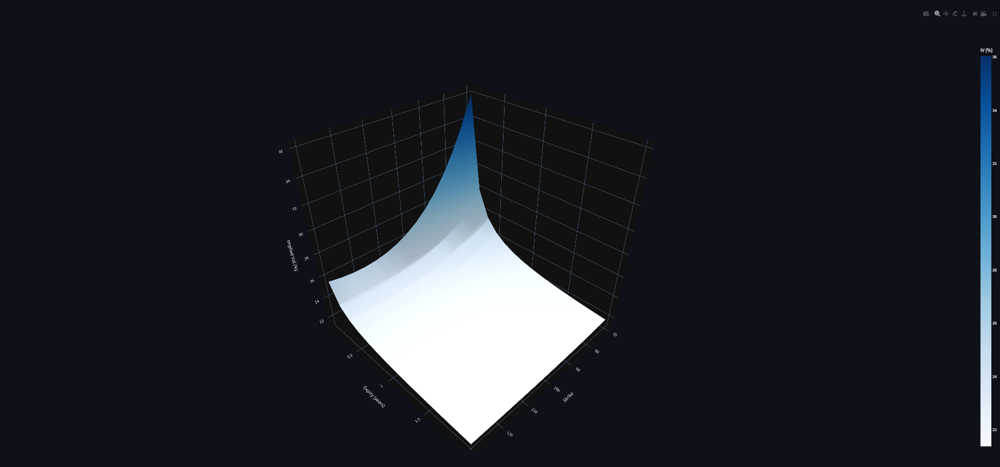
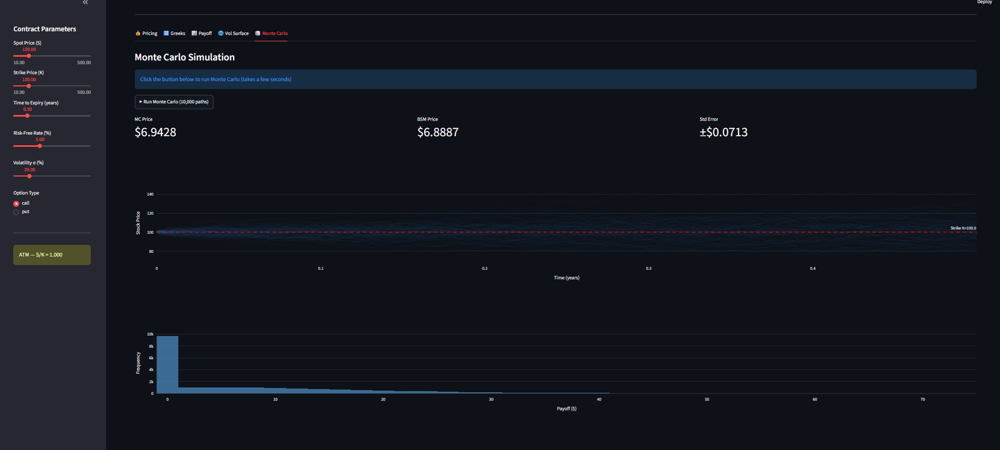

# 📈 Options Pricing & Greeks Dashboard

An interactive quantitative finance dashboard built in Python covering
options pricing models, Greeks, Monte Carlo simulation, and implied
volatility surface construction.

## Features
- **Black-Scholes-Merton** closed-form pricing
- **Binomial Tree (CRR)** with convergence analysis
- **Monte Carlo** simulation with antithetic variance reduction
- **Greeks** — Delta, Gamma, Vega, Theta, Rho
- **Implied Volatility Surface** with vol smile/skew
- Interactive sliders for all contract parameters

## Screenshots

### 💰 Pricing & Model Comparison


### 🔢 Greeks


### 📊 Payoff Diagram


### 🌐 Volatility Surface


### 🎲 Monte Carlo Simulation


## Installation
```bash
git clone https://github.com/muditjain936/options-dashboard.git
cd options-dashboard
python -m venv venv
venv\Scripts\activate
pip install -r requirements.txt
streamlit run app.py
```

## Tech Stack
- `numpy` / `scipy` — mathematical engine
- `plotly` — interactive charts
- `streamlit` — web dashboard
